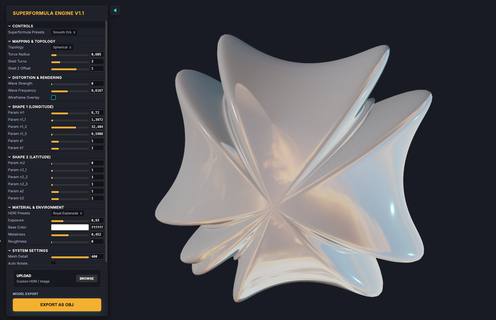

# Supershapes / SuperFormula

## The Project
One equation to rule them all — Johan Gielis' Superformula (2003) is a single mathematical formula that can describe an almost infinite range of natural shapes: flowers, shells, starfish, crystals, and things that don't even exist in nature yet.

First I built a fully parametric 3D implementation in Blender Geometry Nodes — entirely procedural, no sculpting, no modeling. Just pure math turned into geometry in real time. You find the Blender Version [here:] (https://superhivemarket.com/products/gielis-superformula-in-blender)

This idea for this Project was to reproduce a similar way, but realized pure Web-based. Equal on both: Every parameter is live-editable — tweak a number, the shape transforms instantly. From a perfect sphere to a nautilus shell to something completely alien, all within the same node graph.

## Key Features
- 🔵 Two independent superformulas combined via a spherical product 
- 🟠 Sphere ↔ Torus topology switch for ring-based forms 
- 🟤 Shell mode with Archimedes and Logarithmic spirals 
- 🐚 Shell_Turns parameter to control how many revolutions the shell grows 
- 🎨 Natural UV mapping that follows the shape's own coordinate space

## Screen Shot (click to visit)
)

## Images
| Object | Preview |
| :--- | :--- |
|  |  |
|  |  |
|  |  |

## Release Notes

### v1.0.0 (August 15, 2026)
- **Publishing**: First public upload of the Add-on.

### Blender

